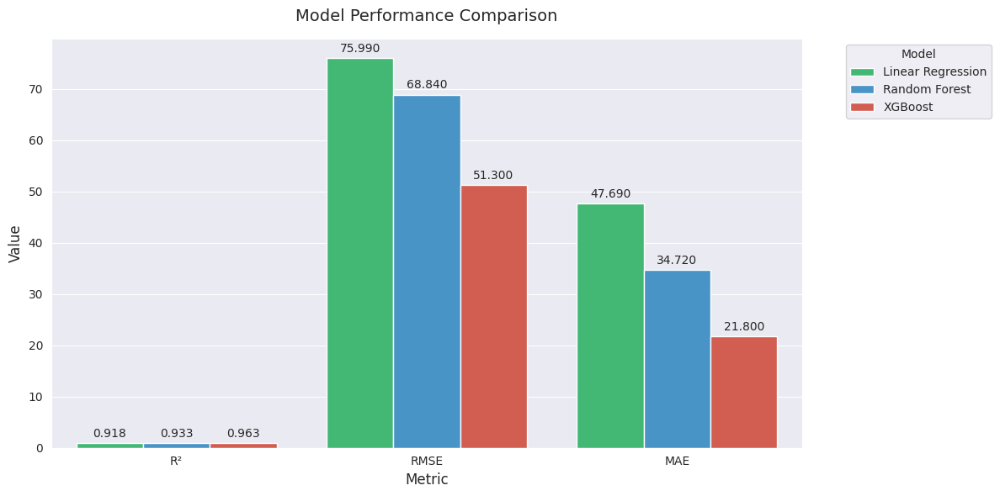
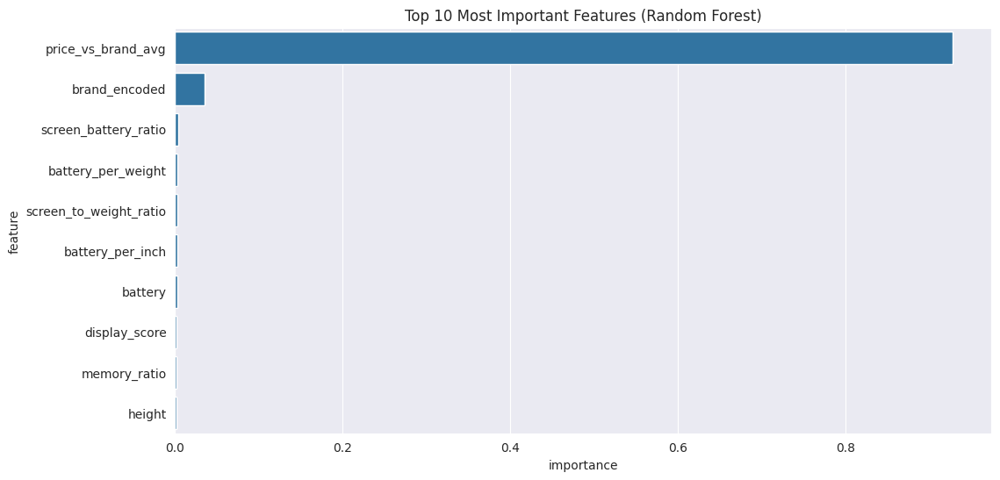
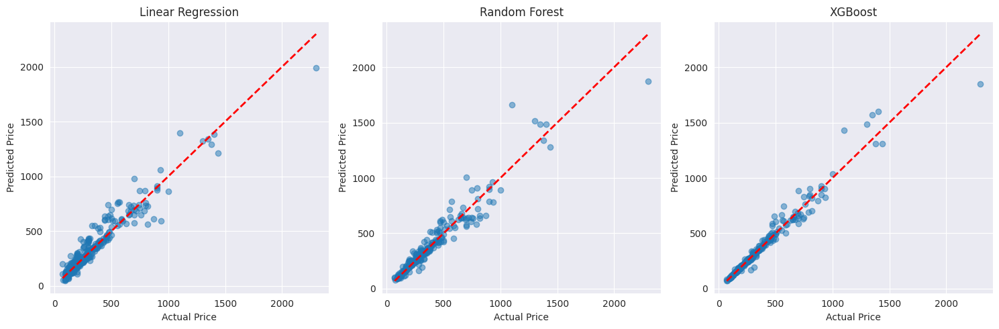

# Smartphone Price Prediction Analysis

## Project Overview
This project analyzes a dataset of 1,512 smartphones to develop a predictive model for smartphone pricing. Using machine learning techniques, we explored the relationships between phone specifications, brand positioning, and market prices to create an accurate pricing model.

## Dataset
The dataset includes various smartphone attributes:
- Technical specifications (RAM, storage, battery)
- Display features
- Video capabilities
- Brand information
- Physical characteristics
- Price information

*Top features driving smartphone prices*

## Key Results
Model performance comparison:

| Model | R² Score | RMSE | MAE |
|-------|----------|------|-----|
| Linear Regression | 0.925 | $75.99 | $47.69 |
| Random Forest | 0.937 | $68.84 | $34.72 |
| XGBoost | 0.961 | $51.30 | $21.80 |

*Model predictions compared to actual prices*

## Implementation
1. **Jupyter Notebooks** (`/notebooks`):
   - Show your thought process
   - Include visualizations and explanations
   - Demonstrate the analysis flow
   - Great for reproduction and learning

2. **Python Scripts** (`/src`):
   - Clean, production-ready code
   - Modular and reusable functions
   - Easier to import and use in other projects
   - Better for deployment

## Tools Used
- Python 3.8+
- Pandas, NumPy
- Scikit-learn
- XGBoost
- Seaborn, Matplotlib

## Author
Joshua Ndala
